# Event Ticketing Microservices API

A comprehensive event ticketing platform backend built with Spring Boot and Spring Cloud microservices. This system demonstrates a scalable, event-driven architecture for managing events, venues, bookings, and orders.

## Overview

The Event Ticketing API is composed of several independent microservices that work together to provide a complete ticketing platform:

- **api-gateway**: Central entry point that routes and manages HTTP requests to underlying services, handles authentication and authorization
- **inventory-service**: Manages event and venue information, handles inventory tracking and availability
- **booking-service**: Processes customer bookings, communicates with inventory service for availability checks, publishes booking events
- **order-service**: Consumes booking events from Kafka and processes orders, maintains order records and status

## System Architecture

```mermaid
architecture-beta

    group clientLayer(cloud)[Client Layer]
        service clientApp(internet)[Client] in clientLayer


    group gatewayLayer(cloud)[API Gateway Layer]
        service apiGateway(server)[API Gateway] in gatewayLayer
        service openapi(server)[Central OpenAPI Swagger UI] in gatewayLayer


    group serviceLayer(cloud)[Internal Microservices]
        service orderService(server)[Order Service] in serviceLayer
        service bookingService(server)[Booking Service] in serviceLayer
        service inventoryService(server)[Inventory Service] in serviceLayer


    group messagingLayer(cloud)[Event Messaging]
        service kafkaBroker(server)[Kafka] in messagingLayer

    group persistenceLayer(cloud)[Persistence]
        service mysqlDatabase(database)[MySQL] in persistenceLayer
    group securityLayer(cloud)[Security]
        service keycloakAuth(lock)[Keycloak] in securityLayer

    clientApp:R --> L:apiGateway

    apiGateway:R --> L:bookingService
    apiGateway:B --> T:inventoryService

    apiGateway:R --> L:openapi

    apiGateway:B --> T:keycloakAuth

    bookingService:B --> T:kafkaBroker

    kafkaBroker:R --> L:orderService

    orderService:R --> L:inventoryService

    bookingService:B --> T:mysqlDatabase
    inventoryService:B --> T:mysqlDatabase
    orderService:B --> T:mysqlDatabase

```



## Technologies

- **Java 25**: Latest Java language features with forward compatibility
- **Spring Boot 4.x**: Latest version with GraalVM native image support
- **Spring Cloud**: Microservices orchestration and service discovery
- **Spring Cloud Gateway**: API gateway for request routing
- **Spring Security**: OAuth2 and JWT-based authentication
- **Spring Data JPA**: ORM and database access
- **Kafka**: Event-driven messaging and asynchronous processing
- **MySQL**: Relational database for persistence
- **Keycloak**: Identity and access management
- **Flyway**: Database migration management
- **Lombok**: Reduce boilerplate code
- **SpringDoc OpenAPI**: API documentation and Swagger UI
- **Gradle**: Build automation tool
- **Resilience4j**: Circuit breaker and fault tolerance

## Prerequisites

Ensure the following tools are installed on your system:

- **Java 25**: Download from [oracle.com](https://www.oracle.com/java/) or use your preferred JDK distribution
- **MySQL 8.0+**: Database server for data persistence
- **Apache Kafka**: Message broker for event streaming
- **Keycloak**: Identity and access management server (optional for development)
- **Gradle**: Build tool (or use the provided Gradle wrapper)
- **Docker** (optional): For running services in containers

## Project Structure

```text
inventory-microservices/
├── apigateway/                 # API Gateway service
│   ├── src/main/java/
│   │   └── com/apigateway/
│   │       ├── config/         # Security and application configuration
│   │       └── route/          # Service routing configuration
│   ├── build.gradle
│   └── gradlew
├── inventoryservice/           # Inventory Management Service
│   ├── src/main/java/
│   │   └── com/inventoryservice/
│   │       ├── controller/     # REST endpoints
│   │       ├── service/        # Business logic
│   │       ├── entity/         # JPA entities (Event, Venue)
│   │       └── config/         # OpenAPI and service configuration
│   ├── src/main/resources/
│   │   └── db/migration/       # Flyway database migrations
│   ├── build.gradle
│   └── gradlew
├── bookingservice/             # Booking Service
│   ├── src/main/java/
│   │   └── com/bookingservice/
│   │       ├── controller/     # REST endpoints
│   │       ├── service/        # Booking business logic
│   │       ├── client/         # Inventory service client
│   │       ├── event/          # Booking event publisher
│   │       └── entity/         # JPA entities (Booking, Customer)
│   ├── build.gradle
│   └── gradlew
└── orderservice/               # Order Processing Service
    ├── src/main/java/
    │   └── com/orderservice/
    │       ├── service/        # Order processing logic
    │       ├── client/         # Inventory service client
    │       ├── entity/         # JPA entities (Order)
    │       └── event/          # Kafka event consumers
    ├── build.gradle
    └── gradlew
```

## Getting Started

### 1. Prerequisites Setup

#### Option A: Using Docker Compose (Recommended)

The `inventoryservice` includes a `compose.yaml` file with all necessary containers pre-configured:

```bash
cd inventory-microservices/inventoryservice
docker compose up -d
```

This automatically starts MySQL and Keycloak with proper configuration.

#### Option B: Manual Docker Setup

Start MySQL database:
```bash
# Using Docker
docker run -d --name mysql \
  -e MYSQL_ROOT_PASSWORD=root \
  -e MYSQL_DATABASE=ticketing \
  -p 3306:3306 \
  mysql:8.0
```

Start Kafka broker:
```bash
# Using Docker
docker run -d --name kafka \
  -e KAFKA_ADVERTISED_LISTENERS=PLAINTEXT://localhost:9092 \
  -e KAFKA_ZOOKEEPER_CONNECT=zookeeper:2181 \
  -p 9092:9092 \
  confluentinc/cp-kafka:latest
```

Start Keycloak (optional for OAuth2):
```bash
docker run -d --name keycloak \
  -e KEYCLOAK_ADMIN=admin \
  -e KEYCLOAK_ADMIN_PASSWORD=admin \
  -p 8080:8080 \
  quay.io/keycloak/keycloak:latest start-dev
```

### 2. Build All Services

Navigate to each service directory and build:

```bash
# Build API Gateway
cd inventory-microservices/apigateway
./gradlew build -x test

# Build Inventory Service
cd inventory-microservices/inventoryservice
./gradlew processAot && ./gradlew bootJar -x test

# Build Booking Service
cd inventory-microservices/bookingservice
./gradlew processAot && ./gradlew bootJar -x test

# Build Order Service
cd inventory-microservices/orderservice
./gradlew processAot && ./gradlew bootJar -x test
```

### 3. Run Services

Start the services in this order:

```bash
# Terminal 1: Start Inventory Service
cd inventory-microservices/inventoryservice
java -Dspring.aot.enabled=true -jar $(find build/libs -name '*.jar' ! -name '*plain.jar')
# Runs on http://localhost:8080

# Terminal 2: Start Booking Service
cd inventory-microservices/bookingservice
java -Dspring.aot.enabled=true -jar $(find build/libs -name '*.jar' ! -name '*plain.jar')
# Runs on http://localhost:8081

# Terminal 3: Start API Gateway
cd inventory-microservices/apigateway
java -jar $(find build/libs -name '*.jar' ! -name '*plain.jar')
# Runs on http://localhost:8082 (accessible entry point)

# Terminal 4: Start Order Service
cd inventory-microservices/orderservice
java -Dspring.aot.enabled=true -jar $(find build/libs -name '*.jar' ! -name '*plain.jar')
# Runs on http://localhost:8083
```

## API Usage

**⚠️ Important**: All services are only accessible through the API Gateway at `http://localhost:8082`. Do not access individual services directly.

### Swagger UI / OpenAPI Documentation

Access the centralized API documentation:
```
http://localhost:8082/swagger-ui.html
```

### Common API Endpoints

#### Inventory Service Endpoints (via API Gateway)

Get venue information:
```bash
curl -X GET http://localhost:8082/api/v1/venue
```

Get event by ID:
```bash
curl -X GET http://localhost:8082/api/v1/events/{eventId}
```

#### Booking Service Endpoints (via API Gateway)

Create a booking:
```bash
curl -X POST http://localhost:8082/api/v1/booking \
  -H "Content-Type: application/json" \
  -d '{
    "userId": 1,
    "eventId": 1,
    "ticketCount": 4
  }'
```

Get booking status:
```bash
curl -X GET http://localhost:8082/api/v1/bookings/{bookingId}
```

#### Order Service

The Order Service does not expose any REST endpoints. It operates as an event consumer that listens to booking events published to Kafka by the Booking Service. Orders are automatically created and processed asynchronously when bookings are made.

## Architecture Patterns

### Event-Driven Communication
- **Booking Service** publishes `BookingEvent` to Kafka when a booking is created
- **Order Service** consumes these events asynchronously and processes orders
- This decoupling allows independent scaling, fault tolerance, and high availability
- No API endpoints are exposed by Order Service; it operates entirely through Kafka event consumption

### Service-to-Service Communication
- **Booking Service** calls **Inventory Service** synchronously to check event availability
- **Order Service** calls **Inventory Service** to update inventory after order processing
- Circuit breakers (Resilience4j) prevent cascading failures and provide automatic fallback mechanisms
- Monitor circuit breaker status via the actuator endpoint

### Data Persistence
- Each service maintains its own MySQL database schema
- Database migrations handled by Flyway
- JPA entities ensure type-safe database operations

## Configuration

### API Gateway Configuration
Located in `apigateway/src/main/resources/application.yml`:
```yaml
server:
  port: 8082
spring:
  cloud:
    gateway:
      routes:
        - id: inventory-service
          uri: http://localhost:8080
          predicates:
            - Path=/api/v1/events/**,/api/v1/venue/**
        - id: booking-service
          uri: http://localhost:8081
          predicates:
            - Path=/api/v1/booking/**,/api/v1/bookings/**
        - id: order-service
          uri: http://localhost:8083
          predicates:
            - Path=/api/v1/orders/**
```

### Service Configuration
Each service has its own `application.yml` with database, server port, and Kafka settings:

**Inventory Service** (`inventoryservice/src/main/resources/application.yml`):
```yaml
server:
  port: 8080
spring:
  datasource:
    url: jdbc:mysql://localhost:3306/ticketing
    username: root
    password: root
```

**Booking Service** (`bookingservice/src/main/resources/application.yml`):
```yaml
server:
  port: 8081
spring:
  datasource:
    url: jdbc:mysql://localhost:3306/ticketing
    username: root
    password: root
  kafka:
    bootstrap-servers: localhost:9092
```

**Order Service** (`orderservice/src/main/resources/application.yml`):
```yaml
server:
  port: 8083
spring:
  datasource:
    url: jdbc:mysql://localhost:3306/ticketing
    username: root
    password: root
  kafka:
    bootstrap-servers: localhost:9092
```

## Development

### Building with AOT (Ahead-of-Time Compilation)
The services are configured for GraalVM native image compilation:
```bash
./gradlew processAot && ./gradlew bootJar -x test
```

This enables faster startup times and reduced memory footprint.

### Running Tests
```bash
./gradlew test
```

### Code Quality
Using Lombok to reduce boilerplate:
- `@Data` for getters/setters
- `@Slf4j` for logging
- `@Service`, `@Controller` for component annotations

### Resilience & Fault Tolerance
The system uses Resilience4j for:
- Circuit breakers to prevent cascading failures
- Retry mechanisms for transient failures
- Timeout management for service calls
- Monitor all circuit breakers at: `http://localhost:8082/actuator/circuitbreakers`

## Monitoring and Debugging

### Application Health Checks
```bash
curl http://localhost:8082/actuator/health
```

### Service Endpoints
```bash
curl http://localhost:8082/actuator/env
```

### Circuit Breaker Monitoring

Monitor the health and status of circuit breakers:
```bash
curl http://localhost:8082/actuator/circuitbreakers
```

This endpoint provides insights into:
- Circuit breaker state (CLOSED, OPEN, HALF_OPEN)
- Number of successful and failed calls
- Slow call metrics
- Last state transition details

## Troubleshooting

### Connection Issues
- Verify MySQL is running: `mysql -u root -p -h localhost`
- Check Kafka is running: `kafka-broker-api-versions --bootstrap-server localhost:9092`
- Verify ports are not in use: `lsof -i :8080,8081,8082,8083`
- Ensure all services are running before accessing the API Gateway
- All API requests must go through API Gateway on port 8082
- If using docker-compose, verify containers are running: `docker compose ps` (from inventoryservice directory)

### Service Discovery Issues
- Check API Gateway routes are configured correctly
- Verify service URLs in application configuration
- Review logs for connection errors

### Database Issues
- Ensure database `ticketing` exists
- Check Flyway migrations are applied: `http://localhost:8082/actuator/flyway` (through API Gateway)
- Verify MySQL user permissions
- If using docker-compose, the database is automatically initialized

### Kafka / Event Processing Issues
- Verify Kafka broker is running and accessible
- Check Kafka topics are created for booking events
- Monitor Order Service logs for event consumption errors
- Order Service processes events asynchronously; there may be a slight delay between booking creation and order processing

## Contributing

1. Create a feature branch for your changes
2. Make commits with clear, descriptive messages
3. Ensure all tests pass: `./gradlew test`
4. Submit a pull request with details of your changes

## License

This project is provided as a demonstration of Spring Boot microservices architecture.

## Additional Resources

- [Spring Boot Documentation](https://spring.io/projects/spring-boot)
- [Spring Cloud Documentation](https://spring.io/projects/spring-cloud)
- [Kafka Documentation](https://kafka.apache.org/documentation/)
- [Keycloak Documentation](https://www.keycloak.org/documentation.html)
- [SpringDoc OpenAPI](https://springdoc.org/)
